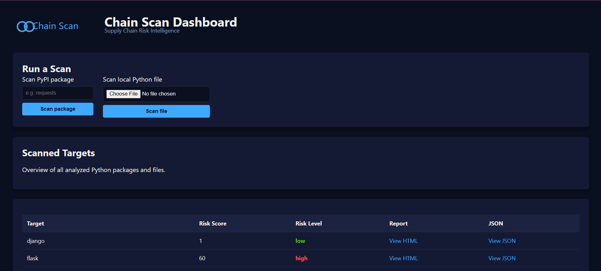
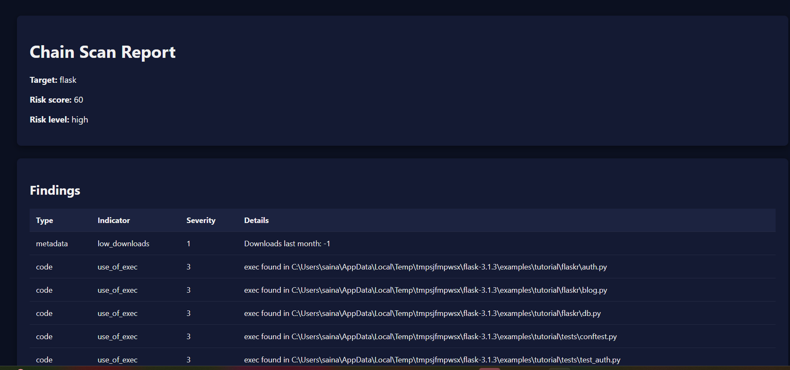
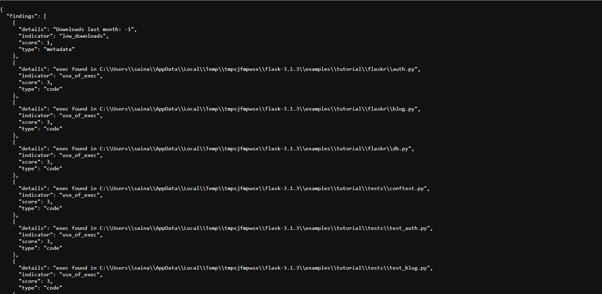

### Chain Scan
Supply Chain Risk Intelligence for Python Packages
Chain Scan is a Python‑based security analysis tool that detects supply‑chain risks in PyPI packages and local Python files. It performs metadata analysis, code scanning, suspicious pattern detection, and generates both CLI and HTML reports — including a fully interactive web dashboard.

Chain Scan helps developers, security engineers, and researchers quickly identify risky dependencies before they enter production.

### Features

🔍 PyPI Package Scanning
- Fetches package metadata

- Downloads and analyzes source distributions

- Detects suspicious patterns (e.g., eval, exec, pickle, os.system)

- Flags low‑trust metadata (e.g., missing homepage, low downloads)

🧪 Local File Scanning
- Upload any .py file

- Detects dangerous functions and modules

- Generates detailed risk reports

📊 Interactive Web Dashboard
- Live Flask dashboard

- Scan packages or upload files directly from the browser

- View HTML and JSON reports

- Color‑coded risk levels

- Branded Chain Scan interface

📁 Report Generation
- JSON reports for automation

- HTML reports for human review

- Dashboard summary of all scans

🖥️ Web Dashboard
- Start the dashboard:

python webapp.py

- Open your browser:

http://127.0.0.1:5000

You’ll see:

- Scan PyPI package form

- Upload Python file form

- Table of scanned targets

- Links to HTML + JSON reports

🛠️ CLI Usage
- Scan a PyPI package

python main.py --package requests

- Scan a local Python file

python main.py --path my_script.py

Reports are saved to:
reports/

📂 Project Structure
supply-chain-management/
│
├── analyzer.py
├── indicators/
│   ├── metadata.py
│   ├── code.py
│   └── __init__.py
├── pypi_client.py
├── reporter.py
├── dashboard.py
├── webapp.py
│
├── reports/        # Generated reports
├── static/         # Logo + favicon
└── uploads/        # Uploaded files

🔒 Risk Scoring
Chain Scan assigns a risk score based on:

- Metadata indicators

- Code indicators

- Suspicious functions

- Suspicious modules

Risk levels:

Score	Level
0–4	Low
5–9	Medium
10+	High

🎨 Branding
Chain Scan includes:

- Custom SVG logo

- Favicon

- Branded dashboard

- Branded HTML reports

🧭 Roadmap
Planned enhancements:

- Dependency graph analysis

- Risk propagation modeling

- Requirements.txt scanning

- Dashboard charts (risk distribution, severity breakdown)

- Dark/light mode toggle

- Deployment to Render/Railway/Azure

## Screenshots
- Dashboard 
The Chain Scan dashboard provides a clean, modern interface for scanning Python packages and files.

- Scan Results
Each scan generates a detailed HTML report showing:
Risk score
Risk level
Metadata findings
Code findings
File paths
Severity indicators

- JSON Report Output
Machine‑readable JSON reports are generated for automation, CI/CD pipelines, and integrations.

🤝 Contributing
Pull requests are welcome.
If you want to add new indicators or improve the dashboard, feel free to open an issue.